GeoFormulas and TerpsTest
=========================

GeoFormulas
-----------
GeoForumlas is a collection of ellipsoid formulas, written in C++, that are based on the formulas found in Appendix 2 of [FAA document Order 8260.54A](http://www.faa.gov/documentLibrary/media/Order/8260_54A.pdf): Note, [FAA document Order 8260.54A Change 1 and 2](https://www.faa.gov/documentLibrary/media/Order/FAA_Order_8260.58A_Including_Change_1_and_2.pdf), uses code and examples from this repo are used extensively in Appendix E.

> Algorithms and methods are described for calculating geodetic locations (latitudes and longitudes) on the World Geodetic System of 1984 (WGS-84) ellipsoid, resulting from intersections of geodesic and non-geodesic paths. These algorithms utilize existing distance and azimuth calculation methods to compute intersections and tangent points needed for area navigation procedure construction. The methods apply corrections to an initial spherical approximation until the error is less than the maximum allowable error, as specified by the user.

GeoFormulas can now be built as a DLL or statically linked library. VBA macros for Microsoft Excel are also included in the directory, which allows full usage of the GeoFormulas API via the DLL. See the bottom of GeoExcelStub.cls for examples using the API.

GeoFormulas has some dependency on the STL. The version that comes with MSVC 7.1 and 8.0 are sufficient to build the GeoFormulas library.

__WGS84 Ellipsoid Calculation Types__

    Arc Intercept             Geodesic Locus Intersect            Point on LocusP
    Course Intersect          Geometric Mean Meridional           Point to Arc Tangents
    Direct Arc Length         Locus Arc Intersect                 Pt is on Arc
    Discretized Arc Length    Locus Course at Point               Pt is on Geodesic
    Distance Intersection     Locus Intersect                     Pt is on Locus
    Distance to LocusP        Locus Perpendicular Intercept       Tangent Fixed Radius Arc
    Distance to LocusD        Locus Tangent Fixed Radius Arc      Vincenty Direct
    ECEF                      Perpendicular Intercept             Vincenty Inverse
    Geodesic Arc Intercept    Perpendicular Tangent Points

TerpsTest
---------
TerpsTest is a test harness driven by GeoFormulas. The test data and expected results are published in [FAA Order 8260.54A](http://www.faa.gov/documentLibrary/media/Order/8260_54A.pdf) Appendix 2, Attachment C.

The goal of the test harness is to have a solid set of test data and expected results to run against the GeoFormulas. A great deal of effort was put into creating the test suite and to get the results within expected tolerances.

The directory __8260.54ATestData__ contains CSV test data used by TerpsTest. This data was scraped from the 8260_54A.pdf in Appendix 2, attachment C. __8260.54a Test Data Origin.txt__ contains details of history and how the data was collected. If any changes to the test data are made then update this document too.

__Application test Results.txt__ is an implementation log tracking some my thoughts. The code comments and this document will help document how and why certain things are implemented, in order to get the expected test results.

TerpsTest is heavily dependent on C++11 std::regex to parse the CSV test
data. Compilers which support C++11 std::regex are, GCC 4.9+, Clang 3.3+,
and possibly VS 2012+ (current testing is done on VS 2015).

---
Calculation Descriptions
------------------------
All calculations are performed on a WGS84 ellipsoid. The input and output is done in the following units -
* Latitudes and Longitudes - HDMS: N23 12 06.3227, N23.12.06.3227, 23 12 06.3227N, 23.12.06.3227N, are all examples of the same input value. After input validation the input is transformed and stored internally as a double. Outputs are shown in HDD MM SS.ss
* Distances: Input units are Meters, Nautical Miles, and Feet. Internally the input is converted and stored in meters. Output units can be meters, NM, or feet.
* Bearings, angles, and azimuths: Inputs are in DD.ddd decimal degrees. Internally the input is converted and stored as radians. Output is always decimal degrees.

---
#### Inverse (Vincenty)
*Input:*
Pt1, Pt2

*Output:*
Crs12, Dist12

---
#### Direct (Vincenty)
*Input:*
Pt1, Crs12, and Dist12

*Output:*
Pt2

---
#### Is Point on Geodesic
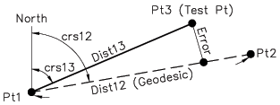

*Input:*
Geodesic defined by Pt1 and Pt2
Test Pt3

*Output:*
True if Pt3 is on geodesic, false otherwise.
   

---
#### Is Point on Arc
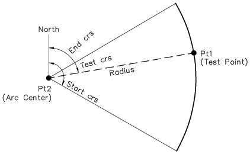

*Input:*
Test Pt1
Pt2 - Center of arc
Start azimuth
End azimuth
Arc radius
Arc direction

*Output:*
True if Pt1 is on arc, false otherwise.
        

---
#### Arc Length
*Input:*
Test Pt1 - Center of Arc
Start azimuth
End azimuth
Arc radius
Arc direction Number of Segments (1 - 32)

*Output:*
Computed direct arc length Computed discretized arc length

---
#### Bearing - Bearing Intercept
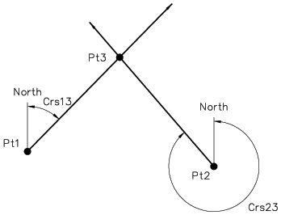

*Input:*
Pt1
Crs13
Pt2
Crs23

*Output:*
Pt3
Dist13, Az31
Dist23, Az32
         

---
#### Distance - Distance Intercept (Arc Intercept)
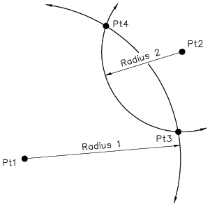

*Input:*
Pt1 - Center pt of arc 1
Arc 1 radius
Pt2 - Center pt of arc 2
Arc 2 radius

*Output:*
Pt3 - Intersection 1
Pt4 - Intersection 2
          

---
#### Geodesic - Arc Intercept
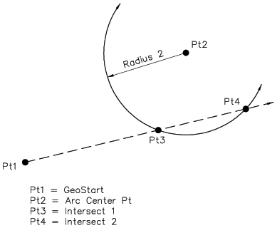

*Input:*
Pt1
Bearing (azimuth)
Pt2 - Center pt of arc 1
Arc 2 radius

*Output:*
Pt3 - Intercept 1
Pt4 - Intercept 2
           

---
#### Tangent Fixed Radius Arc
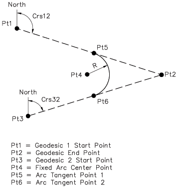

*Input:*
Pt1
Bearing (azimuth 12)
Pt3
Bearing (azimuth 32)
Arc radius

*Output:*
Pt4 - Arc center
Pt5 - Tangent start point
Pt6 - Tangent end point
            

---
#### Perpendicular Intercept
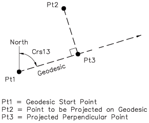

*Input:*
Pt1
Bearing (azimuth)
Pt2

*Output:*
Pt3 - Intercept point
Dist13
Az13
Dist23
Az23
        

---
#### Point to Arc Tangents
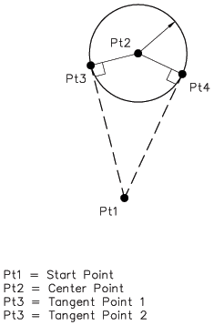

*Input:*
Pt1
Pt2 - Arc center point
Arc radius

*Output:*
Pt3 - Tangent point 1
Pt4 - Tangent point 2
             

---
#### Perpendicular Tangent Points
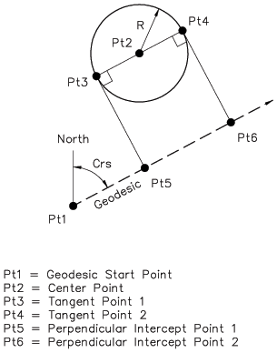

*Input:*
Pt1
Azimuth
Pt2 - Arc center point
Arc radius

*Output:*
Pt3 - Tangent point 1
Pt4 - Tangent point 2
Pt5 - Intercept point 1
Pt6 - Intercept point 2
             

---
#### Is Point on Locus
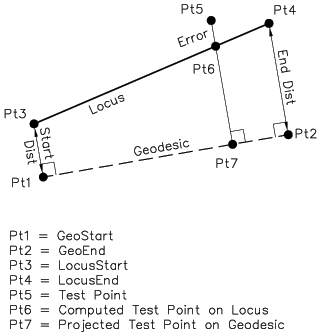

*Input:*
Pt5 - Test point
Locus definition
Pt1 - Geodesic start point
Pt2 - Geodesic end point
Start point offset - locus start point Pt3
End point offset - locus end point Pt4

*Output:*
True if Pt5 is on locus between Pt3 and Pt4, false otherwise.
          

---
#### Locus Course at Point
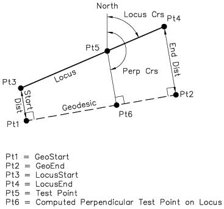

*Input:*
Pt1 - Geodesic start point
Pt2 - Geodesic end point
Pt5 - Point on locus (geodesic offset point)
Bearing - Locus bearing

*Output:*
Pt3 - Locus start point
Pt4 - Locus end point
Dist13
Dist24
Pt6 - Pt5 projected perpendicular onto geodesic
          

---
#### Geodesic - Locus Intersect
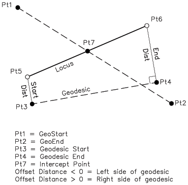

*Input:*
Pt1 - Geodesic start point
Pt2 - Geodesic end point
Locus definition
Pt3 - Geodesic start point
Pt4 - Geodesic end point
Start point offset - locus start point Pt5
End point offset - locus end point Pt6

*Output:*
Pt5 - Locus start point
Pt6 - Locus end point
Dist35
Dist46
Pt7 - Intercept point on locus
         

---
#### Locus - Arc Intersect
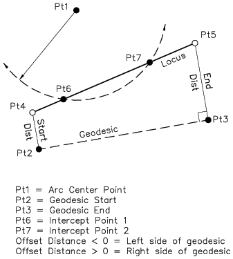

*Input:*
Pt1 - Center point of arc
Arc radius
Locus definition
Pt2 - Geodesic start point
Pt3 - Geodesic end point
Dist24 - locus start point Pt4
Dist35 - locus end point Pt5

*Output:*
Pt4 - Locus start point
Pt5 - Locus end point
Pt6 - Arc intercept point 1 on locus
Pt7 - Arc intercept point 2 on locus
          

---
#### Locus - Locus Intersect
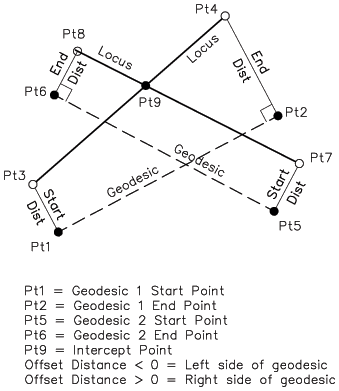

*Input:*
Locus 1 definition
Pt1 - Geodesic start point
Pt2 - Geodesic end point
Dist13
dist 24
Locus 2 definition
Pt5 - Geodesic start point
Pt6 - Geodesic end point
Dist57
Dist68

*Output:*
Locus 1
Pt3 - Locus start point
Pt4 - Locus end point
Locus 2
Pt7 - Locus start point
Pt8 - Locus end point
Pt9 - Intercept of locus 1 and locus 2
          

---
#### Locus Tangent Fixed Radius Arc
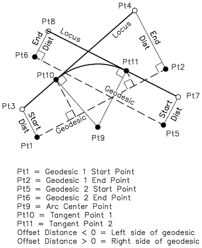

*Input:*
Arc Radius Locus 1 definition
Pt1 - Geodesic start point
Pt2 - Geodesic end point
Dist13
dist 24
Locus 2 definition
Pt5 - Geodesic start point
Pt6 - Geodesic end point
Dist57
Dist68

*Output:*
Locus 1
Pt3 - Locus start point
Pt4 - Locus end point
Locus 2
Pt7 - Locus start point
Pt8 - Locus end point
Pt9 - Intercept of locus 1 and locus 2
           

---
#### Locus Perpendicular Intercept

*Input:*
Pt5 - Point to project onto locus Locus 1 definition
Pt1 - Geodesic start point
Pt2 - Geodesic end point
Dist13
dist 24

*Output:*
Pt3 - Locus start point
Pt4 - Locus end point
Pt6 - Pt projected onto locus
            

---
Legal Stuff
-----------
    Licensed under the Apache License, Version 2.0 (the "License");
    you may not use this software except in compliance with the License.
    You may obtain a copy of the License at

      http://www.apache.org/licenses/LICENSE-2.0

    Unless required by applicable law or agreed to in writing, software
    distributed under the License is distributed on an "AS IS" BASIS,
    WITHOUT WARRANTIES OR CONDITIONS OF ANY KIND, either express or implied.
    See the License for the specific language governing permissions and
    limitations under the License.

Which basically means: whatever you do, I can't be held accountable if something breaks.
